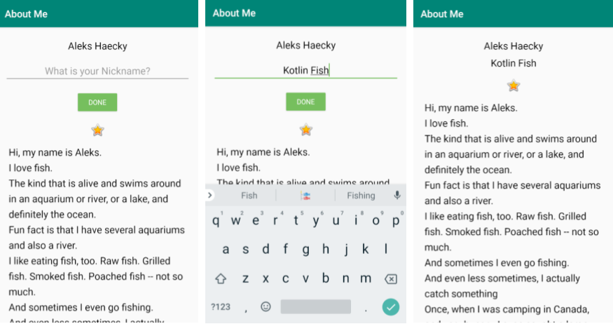

# About Me — Android Kotlin A5

**STEP IT Academy** — Android Mobile Application Development (Kotlin + XML UI)
> Day 5 — Layouts & Data Binding: LinearLayout, ScrollView, EditText, DataBinding

---

## Screenshots



---

## About

**About Me** is a demo app that displays personal information about a person:
- Name (from the `MyName` data class)
- Nickname (entered via `EditText`, stored through two-way DataBinding)
- Profile image
- Scrollable biography (`ScrollView`)

When the user taps **Done**, the nickname is saved into the data class via two-way binding (`@={}`), the `EditText` and Button are hidden, and the nickname `TextView` becomes visible.

---

## Architecture

- Pattern: **Single Activity + DataBinding**
- `MyName` data class serves as a simple model
- `DataBindingUtil.setContentView()` binds the layout to the Activity
- Two-way binding `@={}` keeps `EditText` and `MyName.nickname` in sync

```
MainActivity
    └── binding: ActivityMainBinding (DataBinding)
            └── myName: MyName (data class)
                    ├── name: String
                    └── nickname: String
```

---

## Project Structure

```
app/src/main/
├── java/com/example/android/aboutme/
│   ├── MainActivity.kt        ← setContentView + click handler
│   └── MyName.kt              ← data class (name, nickname)
└── res/
    ├── layout/
    │   └── activity_main.xml  ← <layout> root, two-way binding
    ├── values/
    │   ├── strings.xml
    │   ├── colors.xml
    │   ├── dimens.xml
    │   └── styles.xml
    └── font/
        └── roboto.ttf
```

---

## Tech Stack

| Library | Version |
|---|---|
| AndroidX AppCompat | 1.7.1 |
| AndroidX Core KTX | 1.18.0 |
| Material Components | 1.13.0 |
| ConstraintLayout | 2.2.1 |
| DataBinding | bundled with AGP |

---

## Build Requirements

| Tool | Version |
|---|---|
| Android Gradle Plugin | 9.0.1 |
| Gradle | 9.2.1 |
| JDK | 21 |
| Min SDK | 24 |
| Target SDK | 36 |
| Compile SDK | 36 |

**JDK Setup:** `File → Settings → Build Tools → Gradle → Gradle JDK` → select **Embedded JDK**

---

## Exercise Steps

| Step | Branch | Topic |
|---|---|---|
| 01 | `Step.01-Exercise-Create-layout-file` | Create the basic layout file |
| 01 | `Step.01-Solution-Create-layout-file` | Solution |
| 02 | `Step.02-Exercise-Add-TextView-ImageView-Style` | Add TextView, ImageView, and Style |
| 02 | `Step.02-Solution-Add-TextView-ImageView-Style` | Solution |
| 03 | `Step.03-Exercise-Add-ScrollView` | Add ScrollView for the bio section |
| 03 | `Step.03-Solution-Add-ScrollView` | Solution |
| 04 | `Step.04-Exercise-EditText-DoneButton-ClickHandler` | Add EditText, Done Button, and click handler |
| 04 | `Step.04-Solution-EditText-DoneButton-ClickHandler` | Solution |
| 05 | `Step.05-Exercise-Implement-data-binding` | Implement DataBinding |
| 05 | `Step.05-Solution-Implement-data-binding` | Solution |

### How to work through the exercises

```bash
# Checkout the exercise branch
git checkout Step.XX-Exercise-Topic

# Find and complete the TODOs in the code
# (Android Studio → View → Tool Windows → TODO)

# Compare your work with the solution
git diff Step.XX-Exercise-Topic Step.XX-Solution-Topic
```

---

## Course Info

- **Academy:** STEP IT Academy Cambodia
- **Instructor:** Magn
- **Org:** [chamkartechcambodia-sudo](https://github.com/chamkartechcambodia-sudo)
- **Course:** Android Kotlin — Batch 1
